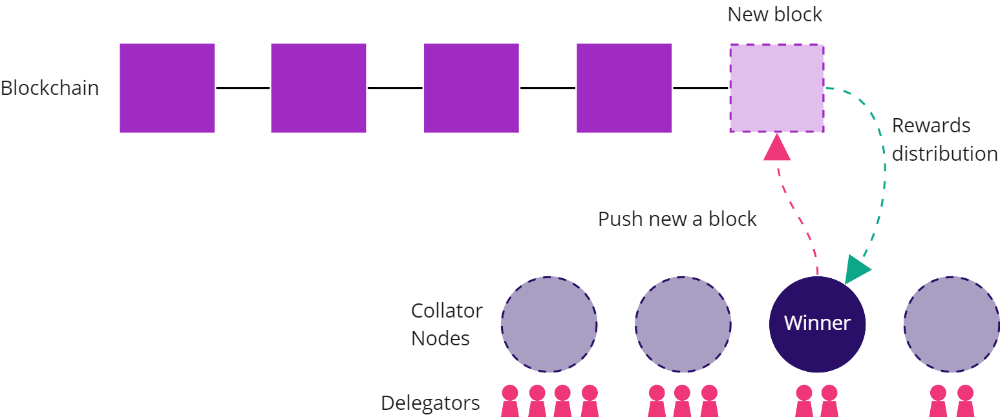
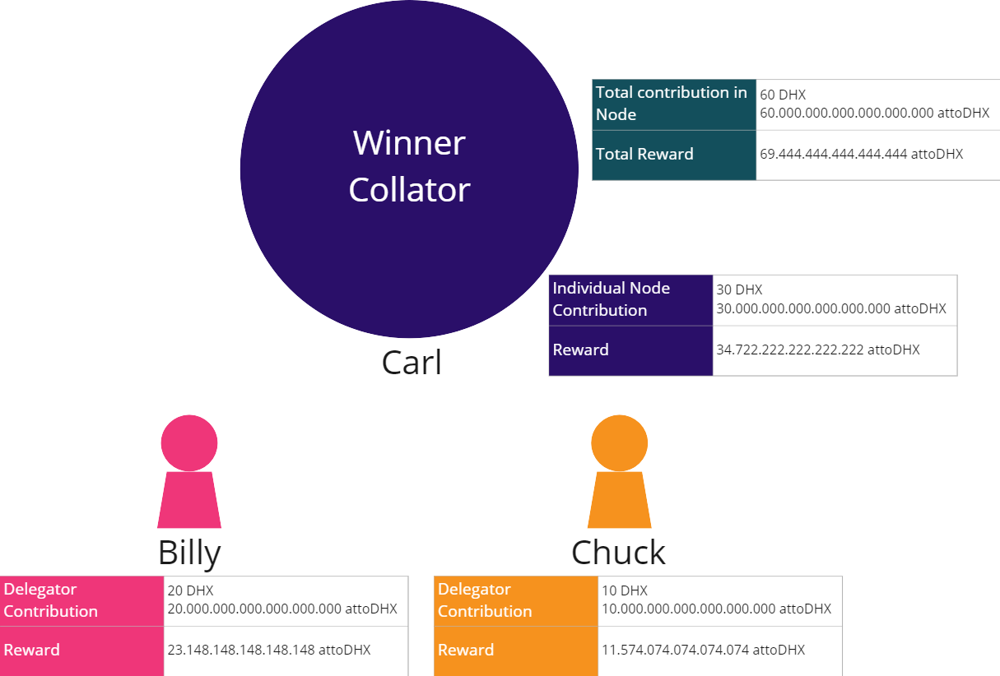

## How do you get DHX tokens from the DHX DAO's Unlocked Reserves?

The DHX DAO Unlocked Reserves (that will be governed by the DHX DAO Treasury) will have 30% of the total supply of DHX tokens at the genesis block and other ongoing fees. These funds will be used to distribute rewards though DataHighway Proof of Participation consensus mechanism by users in governance and mining.

## How to get rewards participating on the DHX blockchain?

DHX is a polkadot parachain, and every 12 seconds, one block is added to the blockchain by a winner Collator Node. Once the Collator wins, the rewards are distributed between the Collator Node and their Delegators:

The winning condition is determined by Kusama consensus protocol. For more details, please 
refer to the <a href=https://guide.kusama.network/docs/learn-consensus/ target="_blank" className="pretty-link pretty-link-colored">Kusama Consensus Documentation</a>.

Community members can participate on the blockchain via two ways:

* Being a Collator node

* Being a Delegator

The collator node is an entity that pushes blocks onto the blockchain. To participate as a collator please documentation this documentation <a href=https://dev.datahighway.com/docs/tutorials/tutorials-nodes-collators-setup/ target="_blank" className="pretty-link pretty-link-colored">Setup Collator Node</a>.

The delegators are community members that support collators and their contributions. To be a Delegator please review the documentation How to become a Delegator [Missing Link]

## How are the rewards calculated?
Every day, 500 DHX are distributed by the block generation. One block is produced every 12 seconds. Everyday has 86400 seconds
 
 
**Blocks per day**

$86.400 seconds / 12 seconds = 7.200 blocks per day$

**DHX per day**

$1DHX = 1.000.000.000.000.000.000 attoDHX$

$500 DHX = 500.000.000.000.000.000.000 attoDHX$

 *We use atto unit* 

**DHX per block**

$500.000.000.000.000.000.000 attoDHX / 7200 block = 69.444.444.444.444.444 attoDHX$

Every time a block is produced, the winning collator node gets 69.444.444.444.444.444 attoDHX
The rewards are distributed among the participants in proportion to their contribution.
Take this picture as an example:

Carl build his own Collator Node and transferred 30 DHX as contribution

Billy joined Carl’s Collator Node and transferred 20 DHX as contribution

Chuck joined Carl’s Collator Node and transferred 10 DHX as contribution

In total, there is 60 DHX on the node. Now, the nodes win, and get the reward = 69.444.444.444.444.444 attoDHX which is distributed proportional to the contribution of each member. Since Billy placed 20 HDX wich is the 33% of the total contribution, he gets, 33% of the total reward, in this case, 23.148.148.148.148.148 attoDHX

